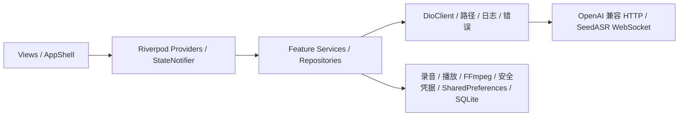

# 声流 VoxFlow

声流是一款面向 Windows 与 Android 的 Flutter 语音生产力应用，提供 OpenAI
兼容接口驱动的语音转文字（STT）、文字转语音（TTS）和本地历史记录。

## 功能

- 麦克风录音、暂停/继续，以及本地音频或视频文件转录；SeedASR 输入自动规范化
- Whisper `verbose_json` 片段解析和 TXT/SRT 导出
- `tts-1` 六种音色、0.25–4.0 倍语速、播放控制和 MP3 另存
- Windows/Android 本地 SQLite 历史、搜索、复制、重播和安全删除
- OpenAI 官方或 HTTPS 兼容代理的 API Root、密钥和模型设置
- 响应式 Material 3 界面：移动端底部导航、桌面端侧边导航

## 项目架构

VoxFlow 采用 Feature-First 的轻量分层架构。业务模块主要按模型、状态编排、
服务和视图拆分；Riverpod 同时负责全局状态管理与依赖装配。网络、路径、日志、
错误处理和主题等跨功能能力集中在 `core/`。

### 启动与依赖装配

应用启动链如下：

```text
main.dart → VoxFlowBootstrap → ProviderScope → VoxFlowApp
          → PrivacyNoticeGate → AppShell
```

`VoxFlowBootstrap` 会先初始化 SharedPreferences 和平台安全凭据存储，校验加密凭据包
中的 API Key/API Root 绑定关系，并在配套 Root 有效时完成旧版明文 API Key 的一次性
迁移，再注入 Riverpod。
`VoxFlowApp` 根据设置装配主题和语言，并在进入主界面前显示数据与隐私说明；
`AppShell` 使用 `IndexedStack` 保存各功能页面状态，并在 Android 显示底部导航、
在 Windows 显示 `NavigationRail`。

### 目录结构

```text
lib/
├── main.dart               # Flutter 入口与平台启动适配
├── bootstrap.dart          # 本地设置初始化与 ProviderScope 装配
├── app.dart                # MaterialApp、主题、语言和隐私门禁
├── core/                   # 网络、路径、日志、错误、主题等共享基础设施
│   ├── constants/
│   ├── errors/
│   ├── logging/
│   ├── network/
│   ├── services/
│   ├── theme/
│   └── utils/
├── features/
│   ├── shell/              # 响应式导航、快捷键与页面容器
│   ├── settings/           # API、模型、主题、语言及隐私设置
│   ├── stt/                # 录音、导入、转录及 TXT/SRT 导出
│   ├── tts/                # 语音合成、播放与 MP3 保存
│   └── history/            # SQLite 历史、搜索、重播与删除
├── l10n/                   # 简体中文与英文文本
└── widgets/                # 跨功能共享 UI 组件
```

每个业务功能按需使用以下子目录：

- `models/`：不可变状态、请求和数据记录
- `providers/`：Riverpod Provider、StateNotifier 和业务流程编排
- `services/`：网络、录音、播放、文件或数据库访问
- `views/`：页面、交互入口和状态呈现
- `widgets/`：功能内部复用的输入控件或展示组件

### 依赖与数据流



- 设置模块通过 Windows 当前用户级 DPAPI 或 Android Keystore 加密保存 API Key 与
  规范化 API Root 的绑定凭据包；供界面编辑的 Root、模型、主题和语言配置保存在
  SharedPreferences，网络请求在发起时动态读取当前已验证配置。
- STT 根据模型选择 Whisper/OpenAI 兼容的 HTTP multipart，或 SeedASR 二进制
  WebSocket。SeedASR 模块会在内部检测输入，并通过 FFmpeg 将不兼容音频临时转换为
  16 kHz、16-bit、单声道 PCM WAV；TTS 通过 `/audio/speech` 获取 MP3 字节。
- STT/TTS 仅在成功后写入历史。SQLite 保存类型、文字、音频路径和创建时间，
  实际音频文件保存在 `path_provider` 返回的应用管理目录。
- 页面主要通过 `ref.watch`/`ref.read` 驱动 Provider；焦点、输入控制器和启动重试等
  局部界面状态仍由 Widget 生命周期管理。

### 平台边界与测试接缝

- Android 使用运行时麦克风权限、原生 `sqflite` 和底部导航。
- Windows 跳过 Android 权限申请，使用 `sqflite_common_ffi`、桌面侧边导航及少量
  MethodChannel 适配；录音插件仍负责检查麦克风是否可用。
- 两个平台的临时文件、数据库和受管音频路径都由 `path_provider` 解析，不硬编码
  系统目录。
- 音频规范化模块隐藏 FFmpeg 参数、输出复验和临时文件清理；原始导入文件不会被
  修改或删除，转换文件在请求结束后清理。
- 网络适配器、WebSocket 连接器、音频转码执行器、数据库工厂、时钟、录音器和
  播放器均保留可注入接缝，自动测试可以使用伪服务和临时数据库而不调用真实 API。

## 环境

- Flutter 3.44+ / Dart 3.12+
- Windows 10/11 与 Visual Studio 2022 Windows 桌面工具链
- Android 8.0（API 26）或更高版本、Android SDK 与 JDK 17

安装依赖：

```shell
flutter pub get
```

开发运行：

```shell
flutter run -d windows
flutter run -d android
```

构建发布产物：

```shell
flutter build windows
flutter build apk --split-per-abi
```

Windows 发布时必须分发 `build/windows/x64/runner/Release` 完整目录，不能只复制
`voxflow.exe`；内置 FFmpeg DLL、Flutter 数据与许可文件都位于该目录中。

## 自动发布

向 `main` 推送包含 `pubspec.yaml` 完整版本变化的提交时，GitHub Actions 会自动
执行静态分析和全部测试，并行构建组织签名的 Android 三 ABI APK 与未签名的
Windows x64 Release ZIP。两端产物全部验证通过后，工作流使用完整版本创建标签
和 GitHub Release，例如 `version: 1.0.0+2` 对应标签 `v1.0.0+2`。

只修改依赖而没有改变 `version:` 不会触发发布。手工运行该工作流只生成 Actions
构建制品，不会创建标签或 GitHub Release。Android 签名配置及仓库权限要求见
[`docs/release/android-signing.md`](docs/release/android-signing.md)。Windows ZIP
仍是未签名的受限测试包，发布时会与三个 APK 一同提供统一 SHA-256 清单。

## API 配置

首次运行后打开“设置”，填写 API Key。默认 API Root 为
`https://one.gloscai.com/v1`，可从 [Glosc 密钥页面](https://www.glosc.ai/keys)
获取 API Key；STT/TTS 模型分别为 `whisper-1` 与 `tts-1`。
自定义代理必须使用 HTTPS，并兼容 `/models`、`/audio/transcriptions` 和
`/audio/speech`。

API Key 在 Windows 上使用当前用户级 DPAPI 加密，在 Android 上使用 Android
Keystore AES-GCM 加密；加密内容同时绑定保存时规范化后的 API Root。普通
SharedPreferences、调试日志和错误提示均不会保存或显示密钥。Android 应用数据不会
进入系统云备份或设备迁移。旧版本留下的明文 Key 或安全存储中的旧格式 Key，只有在
配套 API Root 有效、绑定凭据包写入并回读验证成功后才会自动迁移。API Root 缺失、
无效、与安全包不匹配，或 Key/Root 更新未完整确认时，旧版明文 Key 会被验证删除，
应用会显示凭据恢复提示、隐藏 Key 并禁止自动联网；重新保存一组完整凭据后才解除该
状态。

应用启动后会自动调用 `/models` 检查已保存配置的可用性，并在桌面侧栏状态区域显示
未配置、检测中、已连接或连接失败。设置页还提供“清空全部数据”，可删除安全凭据、
偏好、历史、受管音频、诊断日志与隐私确认；用户导入的原始文件和另存文件不受影响。

转录源文件限制为 25 MB，支持 MP3、MP4、MPEG、MPGA、M4A、WAV 和 WEBM。
选择 SeedASR 时，应用会自动把非目标格式转换为 16 kHz、16-bit、单声道 PCM
WAV；转换后的文件同样不得超过 25 MB。中间文件仅保存在临时目录并会自动清理，
历史记录仍保存原始来源的受管副本。
录音与生成音频均保存在 `path_provider` 返回的应用目录中，不使用硬编码系统路径。

自动转换使用固定版本的最小 LGPL FFmpeg 动态库，未启用 GPL 组件。第三方许可与
对应源码信息见 [`THIRD_PARTY_NOTICES.md`](THIRD_PARTY_NOTICES.md)；发布前仍需核对
最终原生资产的完整许可清单。

## 验证

```shell
dart format --output=none --set-exit-if-changed lib test
flutter analyze
flutter test
```

自动测试使用伪网络适配器与临时 SQLite 数据库，不消耗真实 API 额度。
